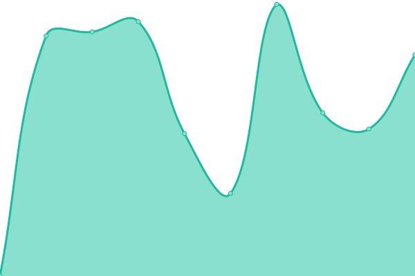
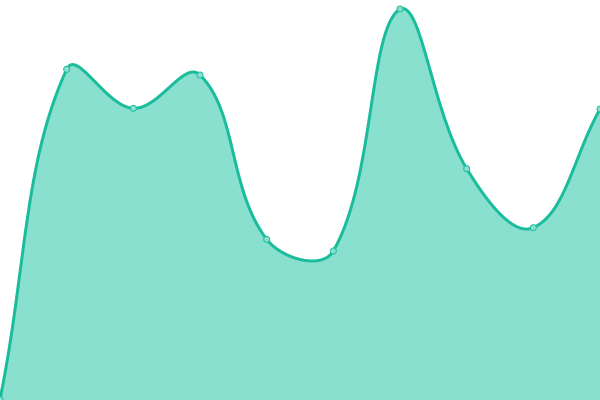
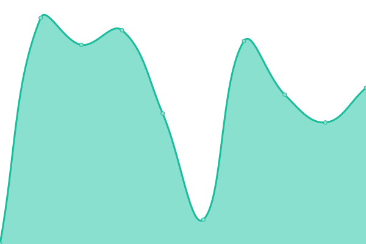
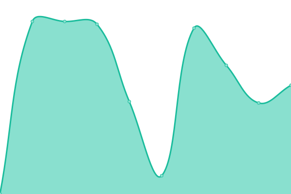

# [📈 Live Status](https://upptime.github.io/upptime): <!--live status--> **🟩 All systems operational**

This repository contains the open-source uptime monitor and status page for [Upptime](https://upptime.js.org), powered by [Upptime](https://github.com/upptime/upptime).

With [Upptime](https://upptime.js.org), you can get your own unlimited and free uptime monitor and status page, powered entirely by a GitHub repository. We use [Issues](https://github.com/upptime/upptime/issues) as incident reports, [Actions](https://github.com/bartallxl/uptime/actions) as uptime monitors, and [Pages](https://upptime.github.io/upptime) for the status page.

<!--start: status pages-->
<!-- This summary is generated by Upptime (https://github.com/upptime/upptime) -->
<!-- Do not edit this manually, your changes will be overwritten -->
<!-- prettier-ignore -->
| URL | Status | History | Response Time | Uptime |
| --- | ------ | ------- | ------------- | ------ |
|  [VolleyballXL.com](https://volleyballxl.com) | 🟩 Up | [volleyball-xl-com.yml](https://github.com/bartallxl/uptime/commits/HEAD/history/volleyball-xl-com.yml) | 

 1422ms
     
 | 

<a href="https://bartallxl.github.io/uptime/history/volleyball-xl-com">99.82%</a>
    

|  [VolleyballXL.de](https://volleyballxl.de) | 🟩 Up | [volleyball-xl-de.yml](https://github.com/bartallxl/uptime/commits/HEAD/history/volleyball-xl-de.yml) | 

 1711ms
     
 | 

<a href="https://bartallxl.github.io/uptime/history/volleyball-xl-de">100.00%</a>
    

|  [VolleybalXL.nl](https://volleybalxl.nl) | 🟩 Up | [volleybal-xl-nl.yml](https://github.com/bartallxl/uptime/commits/HEAD/history/volleybal-xl-nl.yml) | 

 1366ms
     
 | 

<a href="https://bartallxl.github.io/uptime/history/volleybal-xl-nl">100.00%</a>
    

|  [VXL app](https://volleyballxl.com/applogin/) | 🟩 Up | [vxl-app.yml](https://github.com/bartallxl/uptime/commits/HEAD/history/vxl-app.yml) | 

 781ms
     
 | 

<a href="https://bartallxl.github.io/uptime/history/vxl-app">99.82%</a>
    

|  [VXL Register](https://volleyballxl.com/register/) | 🟩 Up | [vxl-register.yml](https://github.com/bartallxl/uptime/commits/HEAD/history/vxl-register.yml) | 

 1038ms
     
 | 

<a href="https://bartallxl.github.io/uptime/history/vxl-register">99.82%</a>
    

|  [VolleyballXL.com - Drills](https://volleyballxl.com/drills/) | 🟩 Up | [volleyball-xl-com-drills.yml](https://github.com/bartallxl/uptime/commits/HEAD/history/volleyball-xl-com-drills.yml) | 

 1026ms
     
 | 

<a href="https://bartallxl.github.io/uptime/history/volleyball-xl-com-drills">99.82%</a>
    

<!--end: status pages-->

[**Visit our status website →**](https://upptime.github.io/upptime)

## 📄 License

- Powered by: [Upptime](https://github.com/upptime/upptime)
- Code: [MIT](./LICENSE) © [Anand Chowdhary](https://anandchowdhary.com), supported by [Pabio](https://pabio.com)
- Data in the `./history` directory: [Open Database License](https://opendatacommons.org/licenses/odbl/1-0/)
